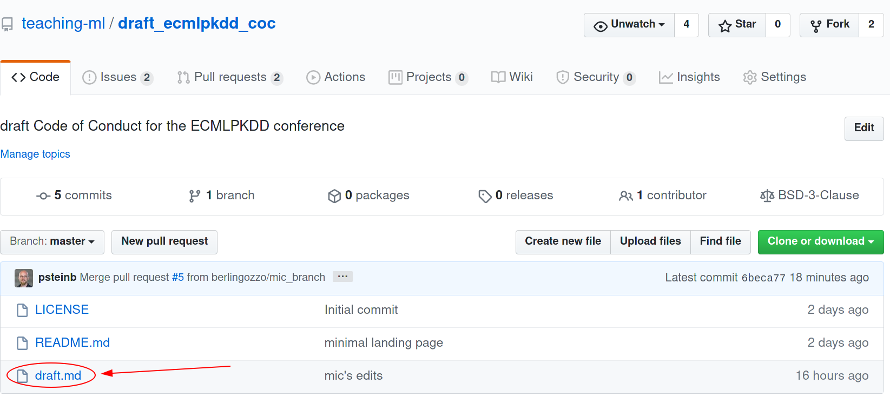
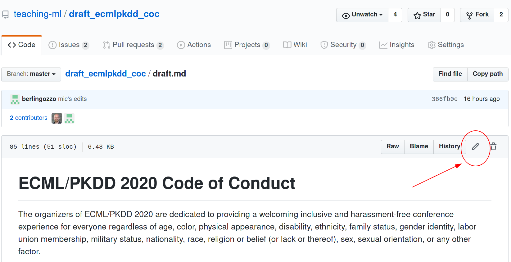
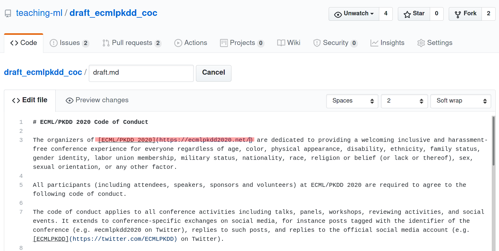
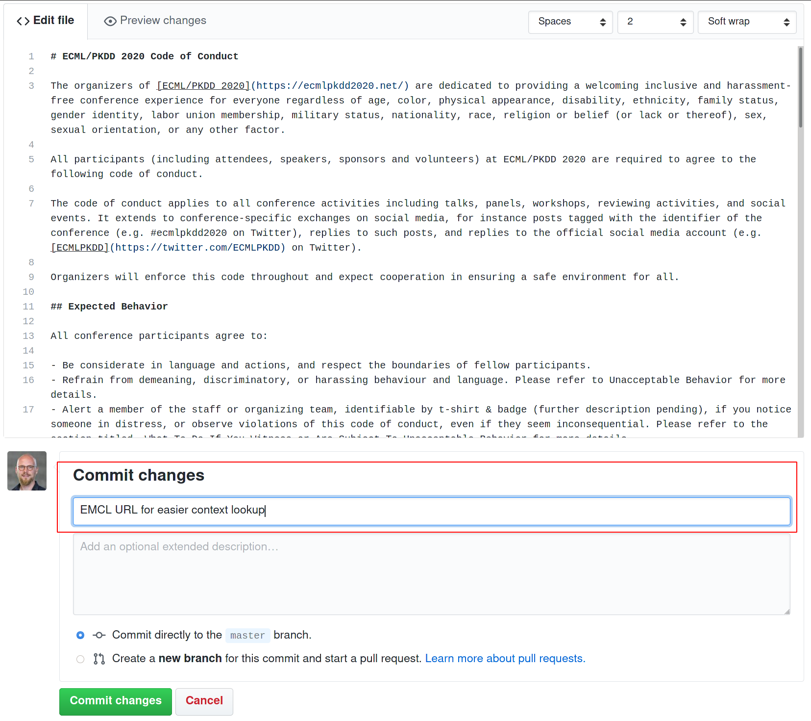
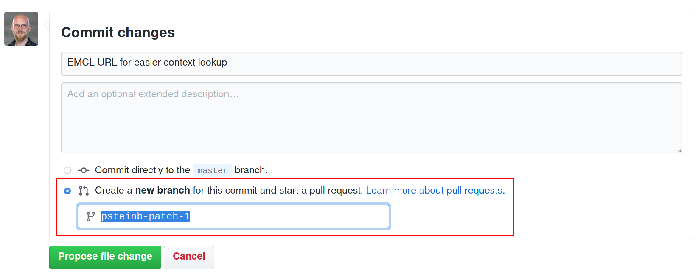
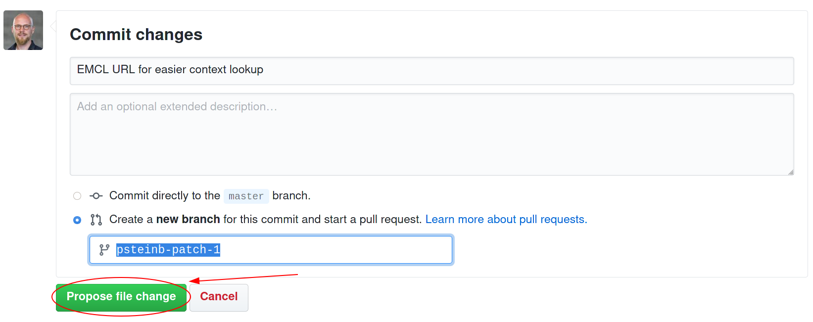
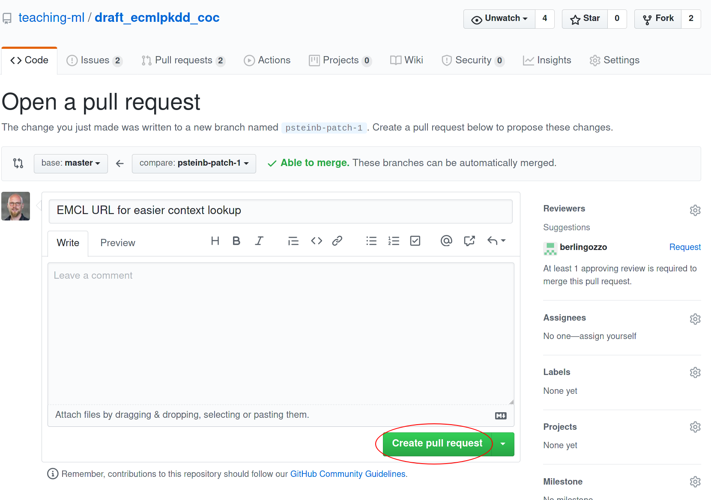
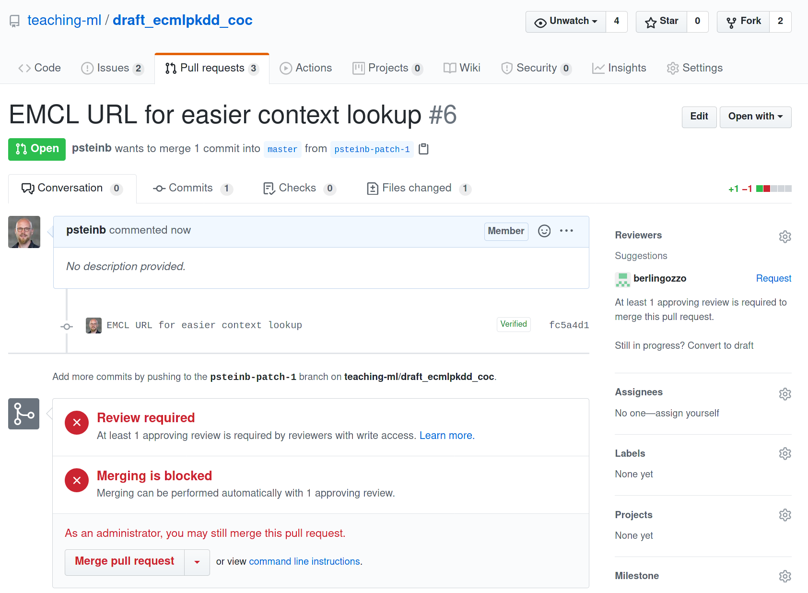

# Draft Code of Conduct for the ECMLPKDD conference

This repo is meant as a central point of contact for the Draft Code of Conduct for the [ECMLPKDD2020](https://ecmlpkdd2020.net/) conference. Feel free to participate. 

The main document is [draft.md](draft.md). It was originally adopted by @HeidiBaya from the code of conduct for [useR! 2020](https://user2020.r-project.org/codeofconduct/) and posted [here](https://hackmd.io/sXV_Et2lRfShUiGOjSHLGw?edit).

You have questions, comments, ideas or feedback, please open an [issue](https://github.com/teaching-ml/draft_ecmlpkdd_coc/issues).

## Contributing

We welcome constructive contributions that help push the code of conduct further and make it ready for submission to the ECMLPKDD steering committee. If you'd like to help, please consider to send us a [Pull Request](https://help.github.com/en/github/collaborating-with-issues-and-pull-requests/about-pull-requests) with the changes you suggest.

In order to merge a Pull Requests, we try to follow a 4-eyes-principle. In order for a PR to merge, the contribution needs to be reviewed. If approved, the submitter must not be the person to merge. With this, we hope to establish a transparent and fair but yet efficient way to shape our code of conduct.

## Contributing without using git

If you don't speak `git` (be it on the [command line](https://en.wikipedia.org/wiki/Command-line_interface) or with [GUI](https://en.wikipedia.org/wiki/Graphical_user_interface) applications), you can still contribute. Here is an image guide recipe on how to do that:

### Click on `draft.md` to open the code of conduct draft

### Click the edit symbol in order to edit the document

### Make your change using [Markdown syntax](https://github.github.com/gfm/)

### Scroll down and describe why you made that change under __commit changes__

### Specify that you would like to make a pull request

### Click "Propose file change"

### In the "Open a pull request" view, click "Create pull request"

### Done!

Your additions will now be reviewed by a maintainer of the repository. Feel free to enter the discussion at will.

